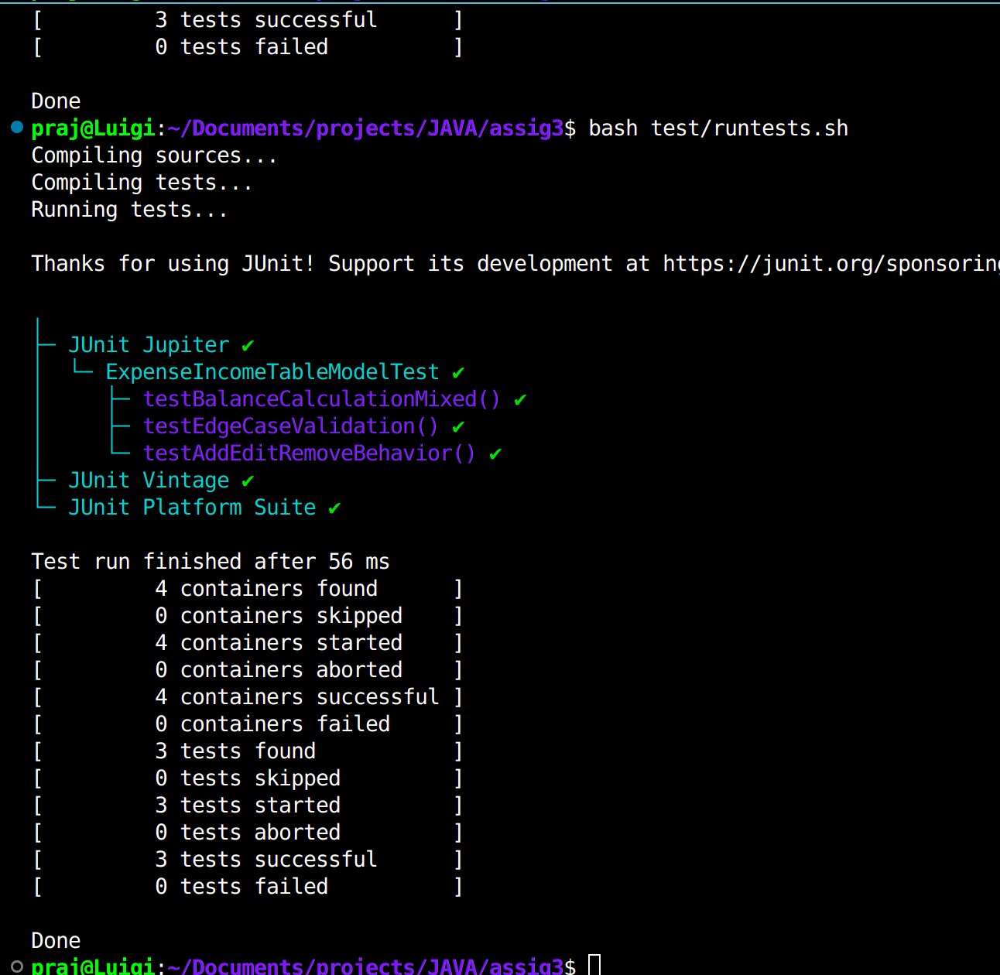
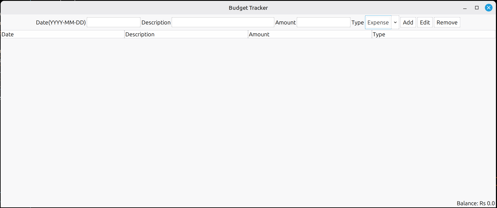
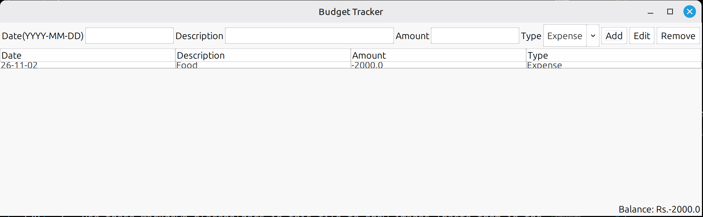
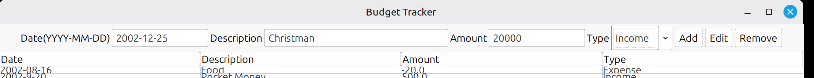
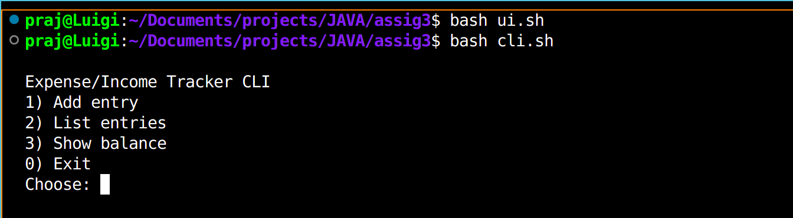
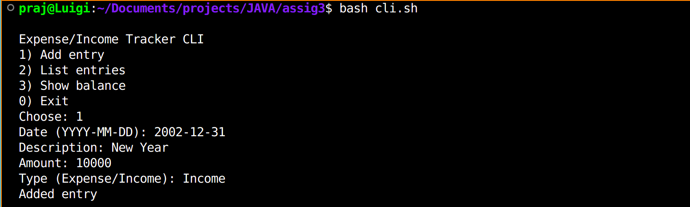
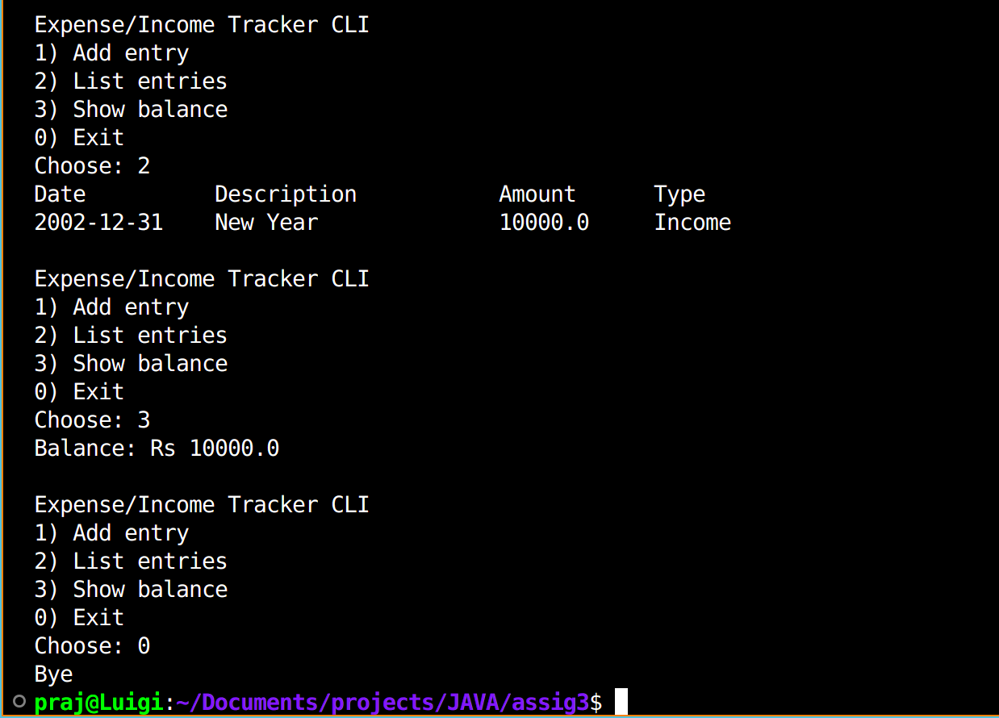

# [Expense & Income Tracker](https://github.com/MetalFingerDev/assig3)

**Name:** [Prajwal Pal](https://github.com/MetalFingerDev/) |
**Reg. no:** 22BCE10643 |
**Date:** 28 Nov 2025

## Introduction

A simple desktop app to track expenses and incomes. I built it to learn Java Swing and get hands-on with a real-world budget tracker.

## Project Objective

Make it super easy for people to quickly log and review incomes/expenses (no Excel, no cloud, no setup). The app demonstrates Swing-based GUIs, a CLI, and simple data model and testing.

## Problem Statement

People need a quick way to record and review their spending and income, without using spreadsheets or online tools.

## Functional Requirements

- Add, edit, and remove entries (expense/income)
- View all entries in a table
- See current balance
- CLI and GUI versions

Major functional modules:

- Entry Management: add/edit/delete entries (date, type, category, amount, description).
- View & Reporting: table view, running balance, and simple summary/total per type.
- Interface & Interaction: CLI for quick testing + GUI (Swing) for day-to-day use.

Inputs / Outputs

- Inputs: entry fields (date, amount, type, category, description) via CLI or GUI.
- Outputs: table rows, current balance label, basic CLI listings, and console messages.

User workflow:

1. Start app (CLI or GUI) using scripts.
2. Add one or more entries.
3. View table and balance; edit or delete entries if needed.
4. (Future) Save or export entries to CSV/JSON.

## Non-functional Requirements

- Easy to use
- Simple error handling
- Fast and lightweight
- Code is modular and easy to maintain

Additional non-functional requirements:

- Usability: minimal clicks in GUI and clear CLI prompts.
- Reliability: basic validation and graceful failure for malformed input.
- Maintainability: small, well-named classes and package structure to make future changes easy.
- Performance: responsive UI for hundreds of entries (no heavy filtering/indexing required now).
- Security/Privacy: no external data transfer; data stays local (future persistent storage optionally encryptable).

## System Architecture

Uses a basic MVC pattern with Java Swing. See [architecture.md](docs/architecture.md) for details.

High-level design notes:

- Model: `ExpenseIncomeEntry`, `ExpenseIncomeTableModel` hold data and validation.
- View: Swing frames and the CLI text prompts for user interaction.
- Controller/Driver: `Expense_Income_Tracker`, `EvaluatorDriver` glue the UI to the model and the table.

## Design Diagrams

UML/class diagrams are in [architecture.md](docs/architecture.md).

Other design artifacts to include (briefly):

- Use Case and Workflow diagrams: show add/view/edit/delete flow (see `docs/architecture.md`).
- Sequence or component diagrams: show how UI interacts with the model and table model.

## Design Decisions & Rationale

I chose Java Swing for cross-platform desktop UI. Simplified the code to avoid extra dependencies and make it easy to run. Scripts help users launch the app without setup.

## Implementation Details

- All code is in `src/expense_income_tracker/`
- Scripts `cli.sh` and `ui.sh` compile and run the app
- Test harness in `test/TestTracker.java`

Files / modules of note:

- `ExpenseIncomeEntry.java` — simple data POJO with validation.
- `ExpenseIncomeTableModel.java` — TableModel for JTable.
- `Expense_Income_Tracker.java` — main/GUI logic.
- `ExpensesIncomesTracker.java` — top-level controller/manager.
- `EvaluatorDriver.java` — CLI driver/test runner.
- `test/TestTracker.java` & `test/ExpenseTracker.java` — basic test harnesses.

Tech / tools: Java 11+ (or compatible), Java Swing for UI, Git for version control, and plain file scripts to run the project.

## Development & Documentation

This repo is a copy adapted from an existing public project. The following summarizes the steps and decisions that were taken while creating the copy and adapting it for the assignment:

- How this copy was produced

  - The original repository was cloned and source locations consolidated to `src/expense_income_tracker` to avoid duplicated files and mismatched package declarations.
  - A few friction points were fixed to make the project runnable without external dependencies.

- Summary of code changes

  - Replaced `FlatLaf` usage with the system look-and-feel using `UIManager.getSystemLookAndFeelClassName()` to avoid requiring an additional jar.
  - Consolidated source files into one package to simplify imports and compilation.
  - Verified compilation output and noted a non-fatal unchecked-operations warning in `ExpenseIncomeTableModel` (generics-related).

- Testing & verification

  - Use the scripts `cli.sh` and `ui.sh` to compile and run the CLI and GUI versions, respectively. These scripts compile the Java sources and run the main classes.
  - A simple test harness (`test/TestTracker.java`) adds two entries and prints table contents and a balance total; this was used to validate the model behavior during development.

- Development workflow & planned tracking
  - Use feature branches for new tasks (e.g., `feature/persistence`, `feature/export-csv`).
  - Consider a CI-enabled branch with unit tests (JUnit) and automated verification before merging.
  - Keep `docs/` updated and use clear commit messages; open issues for larger tasks.

## Known issues / Notes

- The table model has an unchecked-operations compiler note (not fatal). This is safe to ignore but could be cleaned up by adding proper generics or suppressed locally with a comment.
- Data is currently in-memory only — persistent storage (CSV, JSON, or embedded DB like H2) is planned in the roadmap.

## Final verification & Tests

This version adds a small JUnit 5 test suite to verify core model behavior and help reviewers confirm the implementation works as intended.

- Test coverage (small but meaningful):

  - Balance calculation with mixed income/expense entries. (e.g., add -500 and +30000 => 29500)
  - Row add/edit/remove behavior for the `ExpenseIncomeTableModel` (row counts, getValueAt updates, and getBalance reflecting changes).
  - Edge cases: zero amount allowed, date string is not parsed by the model and remains stored as-is, and big amounts are handled correctly.

- Running tests and validation

  - Use `./test/runtests.sh` to automatically download the JUnit console runner, compile sources and tests, and execute tests.
  - Tests are lightweight and fast; they focus on the `ExpenseIncomeTableModel`, not the UI.

  ## What changed in this final version (reviewer summary)

    

  - Code consolidation: Sources were consolidated into a single package and location (`src/expense_income_tracker/`) to reduce confusion and make imports consistent.
  - Dependency reduction: Removed the FlatLaf library (UI theme) to avoid additional jars required at runtime; replaced with system LookAndFeel.
  - Added a JUnit 5 test suite and an automated script (`test/runtests.sh`) to ease verification and to provide a baseline for CI.
  - Added developer-focused documentation in README, and extended REPORT with detailed development rationale and verification steps.

  ## Manual verification steps (for reviewers)

  1. Quick CLI check:

  ```bash
  ./cli.sh
  ```

  2. Run GUI (manual):

  ```bash
  ./ui.sh
  ```

  3. Run the JVM-based tests (JUnit) to verify the model behaviour (automated):

  ```bash
  ./test/runtests.sh
  ```

  Running `./test/runtests.sh` during this session gave these results:

  - 3 tests executed, 3 successful, 0 failed.

  ## Reviewer checks / Acceptance criteria

  - The basic functionality (add/edit/remove entries) works and `getBalance()` returns the correct numeric sum for entries in the model.
  - The UI correctly converts Expense values into negative amounts when adding/updating entries.
  - The test harness (`test/TestTracker.java`) and the JUnit test suite are present and passing locally.

## Development process & challenges (reviewer-friendly summary)

- Process used

  - The code started as a fork of a public repo; sources were consolidated into one package for a clean build.
  - External theme dependency (FlatLaf) was removed to keep the project runnable without jar downloads.
  - Minimal changes were made to keep behavior intact and maintain the original design.

- Challenges resolved
  - Removing a UI dependency (FlatLaf) and defaulting to the system LookAndFeel to ensure the app launched on systems without additional setup.
  - Consolidating the file layout `src/expense_income_tracker/` to avoid confusing imports and duplicated files.
  - Ensuring basic runtime verification via CLI and the test harness: the CLI was exercised (`cli.sh`), and the `test/TestTracker` harness confirms the runtime results.

## Next steps (for reviewers and projects maintainers)

- Add persistent storage (CSV/JSON) and accompanying tests to check save/load behaviour.
- Improve validation of input values (dates, malformed amounts) and consider using a stricter date type (e.g., `LocalDate`) in the model.
- Add CI (GitHub Actions) to run `./test/runtests.sh` on each PR and ensure tests pass automatically.

## Screenshots / Results

I added a few screenshots to capture the main flows. Drop your images into `docs/screenshots/` and give them the filenames below — I used casual captions so you can copy/paste quickly.

( screenshots and filenames in `docs/screenshots/`):









## Testing Approach

Manual testing via CLI and GUI. Used the test harness to check table logic and balance calculation.

Testing notes:

- Manual: run `cli.sh` to exercise add/list/delete, run `ui.sh` for GUI verification.
- Unit/test harness: `test/TestTracker.java` covers the balance and table model behavior; add JUnit later for automated CI.
- Edge cases considered: zero or negative amounts, empty fields, malformed dates.

## Challenges Faced

- Making the UI simple and bug-free
- Removing external dependencies (FlatLaf)
- Keeping code clean and easy to run

## Learnings & Key Takeaways

- How to build a desktop app with Java Swing
- Importance of modular code and error handling
- How to document and organize a project for others

## Future Enhancements

- Save/load entries to file (CSV/JSON)
- Better input validation
- Add sorting/filtering in the UI
- Automated tests (JUnit)

Other ideas (short):

- Add CSV import/export and persistent storage.
- Add categories and monthly summaries.
- Add small set of automated unit tests and a simple GitHub Actions workflow.

## References

- Original repo: https://github.com/bhavesh003/Expense_Income_Tracker

## Repo checklist (what's included)

- README.md: covers title, overview, how to run, and commands.
- statement.md: (optional) short problem statement, scope, target users — add if needed.
- Source: in `src/expense_income_tracker/` with scripts in repo root.
- Docs: `docs/architecture.md` includes class diagrams and architecture notes.

That's it — kept it short and casual. If you'd like, I can also add a `statement.md` and a couple quick UML PNGs into `docs/`.
